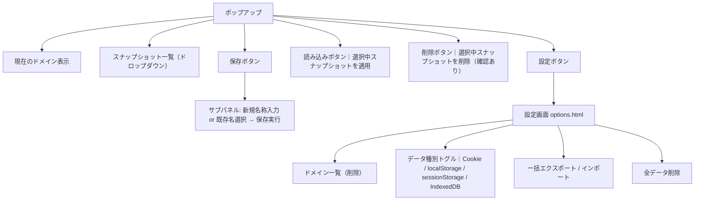
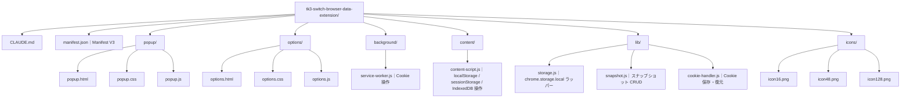

# tk3-switch-browser-data-extension

Chrome / Edge 向けブラウザ拡張機能。ドメインごとに Cookie・localStorage・sessionStorage・IndexedDB を保存し、名前付きスナップショットとして切り替えられる。

## 概要

- **対応ブラウザ**: Chrome, Edge (Chromium ベース・Manifest V3)
- **UI 起点**: 拡張機能アイコンをクリックして開くポップアップのみ（右クリックメニューは使わない）
- **設定画面**: ポップアップ内の設定ボタンまたは `options.html` で開く

## 機能要件

### データ種別（ドメインごとに管理）

| 種別           | API                                                                      |
| -------------- | ------------------------------------------------------------------------ |
| Cookie         | `chrome.cookies` API                                                     |
| localStorage   | `chrome.scripting.executeScript` 経由で `window.localStorage` を読み書き |
| sessionStorage | 同上（`window.sessionStorage`）                                          |
| IndexedDB      | 同上（`indexedDB` を JSON にシリアライズ / リストア）                    |

### スナップショット操作

- **保存**: 現在のデータをスナップショットとして保存する
  - 既存スナップショット名を選択 → 上書き確認後に上書き保存
  - 新規名称を入力 → 新しいスナップショットとして保存
- **読み込み**: 保存済みスナップショットを選択 → 現在のデータをそのスナップショットに丸ごと置き換え
- **削除**: 保存済みスナップショットを選択して削除

### ドメイン管理

- ポップアップはアクティブタブの URL からドメインを自動検出して表示
- 設定画面でドメインの追加・削除・一覧管理が可能
- 保存データはドメインをキーとして `chrome.storage.local` に永続化

### UI 構成



## ディレクトリ構成



## manifest.json の主要設定

```json
{
  "manifest_version": 3,
  "permissions": ["cookies", "storage", "scripting", "activeTab", "tabs"],
  "host_permissions": ["<all_urls>"],
  "background": { "service_worker": "background/service-worker.js" },
  "action": { "default_popup": "popup/popup.html" },
  "options_page": "options/options.html",
  "content_scripts": [
    {
      "matches": ["<all_urls>"],
      "js": ["content/content-script.js"],
      "run_at": "document_idle"
    }
  ]
}
```

## データ構造（chrome.storage.local）

```js
// キー: "snapshots"
{
  "snapshots": {
    "example.com": {
      "スナップショット名": {
        "savedAt": "ISO 8601 timestamp",
        "cookies": [ /* CookieDetails[] */ ],
        "localStorage": { "key": "value", ... },
        "sessionStorage": { "key": "value", ... },
        "indexedDB": { "dbName": { "storeName": [ /* records */ ] } }
      }
    }
  }
}
```

## 技術方針

- **フレームワーク**: バニラ JS（TypeScript は使わない）。依存ライブラリなし
- **スタイル**: CSS のみ（外部 CSS フレームワーク不使用）
- **モジュール**: ES Modules（`type="module"`）
- **非同期**: すべて `async/await` で統一
- **エラー処理**: ユーザー操作起点の処理にのみ try/catch を置く。内部ライブラリは例外を上位に伝播させる
- **コメント**: 非自明な理由がある箇所のみ記述。コードの説明コメントは書かない
- **IndexedDB シリアライズ**: `IDBObjectStore` を全件 `getAll()` で読み出し JSON 化。復元時は既存 store をクリアして `add()` で再投入

## 実装時の注意点

- `chrome.scripting.executeScript` は `activeTab` か `host_permissions` が必要。`func` オプションで関数を渡す形式を使う
- sessionStorage はタブをまたいで取得できないため、コンテンツスクリプト経由でアクティブタブから取得する
- Cookie の `httpOnly` フラグが付いたものは JS からは読めないが `chrome.cookies` API なら取得可能
- IndexedDB の復元時はスキーマ（`keyPath`, `autoIncrement`）も保存しておく必要がある
- `chrome.storage.local` の容量上限は約 10 MB。大量データは警告を表示する

## 開発・テスト

```powershell
# Chrome に読み込む
# chrome://extensions/ → デベロッパーモード ON → 「パッケージ化されていない拡張機能を読み込む」
# → tk3-switch-browser-data-extension を選択

# Edge に読み込む
# edge://extensions/ → 同様の手順
```

- ユニットテストは導入しない（拡張機能 API のモックが複雑なため）
- 手動テストは Chrome の DevTools → Application タブで各ストレージの状態を確認しながら行う
